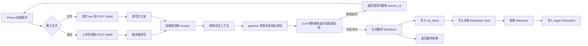

# Record Tips MVP PRD

## 1. 文档说明

- 文档版本：v0.2
- 文档状态：Draft
- 对应上位文档：`docs/PRD.md` 的收敛版 MVP
- 适用阶段：0 -> 1 可运行验证版本
- MVP 原则：保持 iPhone 快捷指令作为唯一交互壳，同时把“语音/文字双输入 + LLM 主动澄清”纳入 MVP，而不是延后到下一阶段

## 2. MVP 一句话定义

这是一个面向单用户、本地优先的“想法澄清与蒸馏网关”：用户通过 iPhone 快捷指令向本地 Bun 服务端发送语音或手动输入的文字，服务端先完成转写与上下文拼装，再由 LLM 通过多轮发问逐步澄清想法，最后将结果沉淀到 PostgreSQL + pgvector、本地 Markdown Vault 和 Apple Reminders。

## 3. MVP 目标

### 3.1 产品目标

1. 验证用户是否愿意在 iPhone 快捷指令中使用语音或手动文字持续倾倒想法。
2. 验证 LLM 主动发问是否能显著提升想法澄清质量，而不是只做一次性摘要。
3. 验证“澄清会话 + 历史语义检索 + 本地知识库落盘”是否能形成可复用知识资产。
4. 验证 Apple Reminders 作为行动项出口，是否能提升用户对输出结果的执行率。

### 3.2 成功标准

1. 用户可以在 iPhone 快捷指令中选择“发送语音”或“发送手动文字”。
2. 服务端在收到每轮输入后，15 秒内返回一个澄清问题或最终结果。
3. 单次想法整理过程最多 3 轮澄清即可得到可用的最终蒸馏结果，或用户可主动要求直接总结。
4. 最终结果生成后，服务端会写入 PostgreSQL、本地 Markdown 文件，并在存在 Milestone 时写入 Apple Reminders。
5. 第二个完整会话开始，系统能够利用历史语义检索参与澄清和最终蒸馏。

## 4. MVP 用户与使用场景

### 4.1 目标用户

- 拥有 Mac + iPhone 的单人创作者、独立开发者、研究者
- 已使用 Obsidian 或其他本地知识库工具的用户
- 高度依赖语音表达，但在某些场景也会补充手动文字的人群

### 4.2 MVP 核心场景

1. 用户在 iPhone 上通过快捷指令选择“录一段语音”或“手动输入文字”。
2. 服务端接收该轮输入，结合当前会话上下文和历史记录，判断信息是否充分。
3. 如果信息不足，LLM 返回一个聚焦的问题，继续追问目标、约束、对象、时间范围或成功标准。
4. 用户继续通过语音或文字回答，快捷指令保留同一个 `session_id` 完成多轮澄清。
5. 当系统判断信息已经足够，或用户明确要求直接总结时，服务端输出最终 Markdown 蒸馏结果。
6. 最终结果写入本地 Vault、向量数据库，并将 Milestone 同步到 Apple Reminders。

## 5. MVP 范围

### 5.1 必须实现

| 模块 | MVP 范围 |
| --- | --- |
| 输入入口 | iPhone 快捷指令作为唯一入口；首轮和追问轮都支持语音或手动文字 |
| 会话编排 | 服务端维护 `session_id`、轮次、状态和上下文，支持多轮澄清 |
| 语音转写 | 服务端接收语音并完成转写；文字输入则直接进入后续链路 |
| 服务运行时 | Bun 启动单进程 HTTP 服务，默认端口 `5001` |
| 模型接入 | 本地模型负责转写后的澄清问答、embedding 和最终蒸馏 |
| 澄清对话 | 无论输入是语音还是文字，LLM 都必须能主动发问并逐步澄清 |
| 向量数据库 | PostgreSQL + pgvector，自动初始化扩展、会话表和知识表 |
| 语义检索 | 使用 SQL + pgvector 对历史已完成想法进行相似检索 |
| 最终蒸馏 | 在澄清充分后，生成结构化 Markdown 结果 |
| 本地知识库 | 将最终 Markdown 文件持久化到环境变量指定目录 |
| 行动同步 | 从最终蒸馏结果中提取 Milestone，并写入 Apple Reminders |
| 数据持久化 | 持久化会话、每轮问答、最终蒸馏结果和 embedding |
| 启动配置 | 使用 `.env` 注入 `BRAIN_VAULT_PATH` 与 `DATABASE_URL` |

### 5.2 明确不做

1. 不做完整 iOS App；MVP 入口仍以 iPhone 快捷指令为准。
2. 不做多人账号体系与云端账户同步。
3. 不做原始音频的长期归档、波形编辑或播放器能力。
4. 不做 Web 管理后台。
5. 不做复杂的主题聚类、自动合并和定时 Refactor。

## 6. 端到端流程



### 6.1 快捷指令交互约束

1. 快捷指令必须保留 `session_id`，用于把多轮回答串成同一会话。
2. 每轮收到服务端问题后，快捷指令必须再次让用户选择“语音回答”或“手动输入”。
3. 当服务端返回 `response_type=final` 时，本次会话结束。
4. 快捷指令需要展示当前问题、轮次和最终 Markdown 结果。

## 7. 功能需求

### 7.1 环境与初始化

| 编号 | 需求 |
| --- | --- |
| MVP-FR-001 | 系统需支持通过 Docker 启动 `pgvector/pgvector:pg16` 作为本地数据库 |
| MVP-FR-002 | 项目根目录必须支持 `.env` 配置文件 |
| MVP-FR-003 | `.env` 中必须配置 `BRAIN_VAULT_PATH` 与 `DATABASE_URL` |
| MVP-FR-004 | 启动时若缺失任一关键环境变量，服务必须失败退出并打印错误 |
| MVP-FR-005 | 项目依赖中必须包含 `pg` 与 `@types/pg` |

### 7.2 服务启动、会话 API 与输入兼容

| 编号 | 需求 |
| --- | --- |
| MVP-FR-101 | 服务端必须使用 Bun 启动 HTTP 服务 |
| MVP-FR-102 | 默认监听端口为 `5001` |
| MVP-FR-103 | 服务端必须提供统一的 `POST /distill` 接口 |
| MVP-FR-104 | 接口必须支持两类输入：`audio` 和 `text` |
| MVP-FR-105 | 文字模式下必须传入 `text` 内容 |
| MVP-FR-106 | 语音模式下必须传入音频文件 |
| MVP-FR-107 | 接口必须支持可选的 `session_id` 以继续已有会话 |
| MVP-FR-108 | 成功响应类型必须为 `application/json` |
| MVP-FR-109 | 成功响应至少包含 `session_id`、`response_type`、`assistant_message`、`turn_index`、`is_complete` |
| MVP-FR-110 | 当输入缺失或格式不合法时，接口返回 `400` |
| MVP-FR-111 | 当处理链路发生异常时，接口返回 `500` 和错误信息 |

### 7.3 语音转写、本地模型与澄清策略

| 编号 | 需求 |
| --- | --- |
| MVP-FR-201 | 服务端必须支持本地语音转写能力，用于处理语音输入 |
| MVP-FR-202 | 语音输入必须先转写为文本，再参与会话上下文拼装 |
| MVP-FR-203 | 服务端必须连接本地 LM Studio，默认地址为 `http://localhost:1234/v1` |
| MVP-FR-204 | Embedding 模型使用 `nomic-ai/nomic-embed-text-v1.5` |
| MVP-FR-205 | 澄清和最终蒸馏使用同一类本地对话模型，例如 `qwen2.5-7b-instruct` |
| MVP-FR-206 | 当 embedding 模型不可用时，系统必须返回错误并提示检查 LM Studio 模型配置 |
| MVP-FR-207 | LLM 在信息不足时必须主动发问，而不是直接总结 |
| MVP-FR-208 | 每轮只允许提出一个聚焦问题，避免一次性追问过多 |
| MVP-FR-209 | 当信息已经充分、达到轮次上限或用户主动要求直接总结时，系统必须输出最终结果 |

### 7.4 会话状态与 PostgreSQL + pgvector

| 编号 | 需求 |
| --- | --- |
| MVP-FR-301 | 启动时自动执行 `CREATE EXTENSION IF NOT EXISTS vector;` |
| MVP-FR-302 | 启动时自动创建 `idea_sessions` 表 |
| MVP-FR-303 | 启动时自动创建 `session_messages` 表 |
| MVP-FR-304 | 启动时自动创建 `my_ideas` 表 |
| MVP-FR-305 | `idea_sessions` 至少记录 `id`、`status`、`turn_count`、`created_at`、`updated_at` |
| MVP-FR-306 | `session_messages` 至少记录 `session_id`、`role`、`input_mode`、`content`、`created_at` |
| MVP-FR-307 | `my_ideas` 至少包含 `id`、`vector`、`raw_text`、`distilled_text`、`created_at` |
| MVP-FR-308 | `vector` 字段维度固定为 `768` |
| MVP-FR-309 | 每轮用户输入和每轮助手发问都必须持久化到会话表中 |
| MVP-FR-310 | 每个完成的会话都必须向 `my_ideas` 插入最终记录 |
| MVP-FR-311 | 每次需要检索历史时，都必须生成向量并格式化为 pgvector 可写入的字符串 |
| MVP-FR-312 | 历史检索逻辑必须基于 `ORDER BY vector <=> $1 LIMIT 2` 或等价能力 |

### 7.5 RAG、澄清与最终蒸馏

| 编号 | 需求 |
| --- | --- |
| MVP-FR-401 | 历史检索结果必须参与每次澄清判断和最终蒸馏的 Prompt 组装 |
| MVP-FR-402 | 没有历史记录时，系统必须使用“无相关历史记录”作为默认上下文 |
| MVP-FR-403 | 澄清问题应优先聚焦缺失信息，例如目标、受众、约束、时间范围、成功标准 |
| MVP-FR-404 | 服务端必须能从最终 Markdown 中提取标题区块和 Milestone 区块 |
| MVP-FR-405 | 最终蒸馏结果必须可直接作为 Markdown 文本保存 |
| MVP-FR-406 | 最终 Markdown 必须至少包含“今日灵感内核”“历史思维连线”“20分钟强制里程碑”三个区块 |

### 7.6 本地 Markdown 知识库

| 编号 | 需求 |
| --- | --- |
| MVP-FR-501 | 服务端必须将最终 Markdown 文件写入 `BRAIN_VAULT_PATH` 指定的绝对路径 |
| MVP-FR-502 | 若目标目录不存在，系统必须自动创建 |
| MVP-FR-503 | 文件名必须由日期和安全标题组成 |
| MVP-FR-504 | 文件内容必须包含 YAML Front Matter |
| MVP-FR-505 | 文件内容必须包含最终蒸馏正文 |
| MVP-FR-506 | 文件内容必须保留会话聚合后的原始意识流文本 |

### 7.7 Apple Reminders 同步

| 编号 | 需求 |
| --- | --- |
| MVP-FR-601 | 系统必须从“20分钟强制里程碑”区块提取待办标题 |
| MVP-FR-602 | 当提取到有效 Milestone 时，系统必须尝试写入 Apple Reminders |
| MVP-FR-603 | 写入方式基于 `osascript -l JavaScript` 调用 macOS Reminders |
| MVP-FR-604 | 提醒事项写入失败不得影响主链路响应，但需打印错误日志 |

### 7.8 快捷指令循环与运行验证

| 编号 | 需求 |
| --- | --- |
| MVP-FR-701 | 服务必须支持通过 `bun --env-file=.env server.ts` 启动 |
| MVP-FR-702 | 启动前要求本地 PostgreSQL pgvector、语音转写能力和 LM Studio 均处于可用状态 |
| MVP-FR-703 | iPhone 快捷指令必须作为首轮和追问轮的统一入口 |
| MVP-FR-704 | 每轮追问时，用户都可以重新选择语音或手动文字回答 |
| MVP-FR-705 | 完成一个最终会话后，用户应能在本地 Vault 目录看到新生成的 Markdown 文件 |
| MVP-FR-706 | 完成一个最终会话后，数据库中应存在对应知识记录和会话记录 |
| MVP-FR-707 | 当输出包含 Milestone 时，Reminders 中应出现新增事项 |

## 8. 技术架构

### 8.1 运行环境

| 层级 | 方案 |
| --- | --- |
| 输入端 | iPhone 快捷指令，支持上传语音或手动输入文字 |
| 服务端 | Bun + TypeScript |
| 转写能力 | 本地 ASR 服务或等价本地转写能力 |
| 模型网关 | LM Studio OpenAI 兼容接口 |
| 主数据库 | PostgreSQL |
| 向量能力 | pgvector |
| 本地知识库 | 环境变量指定的 Markdown Vault |
| 系统集成 | Apple Reminders + `osascript` |

### 8.2 数据模型

`idea_sessions`

| 字段 | 类型 | 说明 |
| --- | --- | --- |
| `id` | `UUID` 或等价主键 | 会话主键 |
| `status` | `TEXT` | `clarifying` / `completed` / `abandoned` |
| `turn_count` | `INT` | 当前会话轮次 |
| `created_at` | `TIMESTAMP` | 创建时间 |
| `updated_at` | `TIMESTAMP` | 更新时间 |

`session_messages`

| 字段 | 类型 | 说明 |
| --- | --- | --- |
| `id` | `SERIAL` | 主键 |
| `session_id` | `UUID` 或等价外键 | 所属会话 |
| `role` | `TEXT` | `user` / `assistant` |
| `input_mode` | `TEXT` | `audio` / `text` / `system` |
| `content` | `TEXT` | 转写后的用户内容、助手问题或最终结果 |
| `created_at` | `TIMESTAMP` | 创建时间 |

`my_ideas`

| 字段 | 类型 | 说明 |
| --- | --- | --- |
| `id` | `SERIAL` | 主键 |
| `vector` | `vector(768)` | embedding 向量 |
| `raw_text` | `TEXT` | 会话聚合后的原始文本 |
| `distilled_text` | `TEXT` | 最终 Markdown 蒸馏结果 |
| `created_at` | `TIMESTAMP` | 创建时间 |

### 8.3 核心函数约束

1. `transcribeAudio(audio)` 负责将语音输入转换为文本。
2. `loadOrCreateSession(sessionId)` 负责会话创建、查找和状态推进。
3. `getEmbedding(text)` 负责生成 768 维向量。
4. `formatVectorForPg(vector)` 负责将向量转换为 pgvector 写入格式。
5. `buildClarifyOrFinalizePrompt(sessionContext, ragContext)` 负责决定当前是继续追问还是直接蒸馏。
6. `saveToLocalVault(title, content, rawText)` 负责 Markdown 持久化。
7. `extractSection(mdText, header)` 负责提取标题和 Milestone。
8. `syncToAppleReminders(taskTitle)` 负责写入系统提醒事项。

## 9. 输出规范

### 9.1 服务端响应格式

服务端返回值必须是 JSON，而不是纯文本。推荐结构如下：

```json
{
    "session_id": "uuid-or-session-key",
    "response_type": "clarify",
    "assistant_message": "你希望这个想法最终产出成什么：代码原型、文档还是流程？",
    "turn_index": 1,
    "is_complete": false,
    "final_markdown": null,
    "final_title": null,
    "milestone": null
}
```

### 9.2 澄清态响应

1. `response_type=clarify`
2. `assistant_message` 必须是一个明确、单点的问题
3. `final_markdown` 为空
4. 快捷指令根据该问题继续向用户收集下一轮语音或文字回答

### 9.3 完成态响应

1. `response_type=final`
2. `assistant_message` 为最终结论摘要或会话结束提示
3. `final_markdown` 必须包含以下三个一级区块：

     - `### 🎯 今日灵感内核`
     - `### 🔄 历史思维连线 (RAG 检索结果)`
     - `### 🚀 20分钟强制里程碑 (Milestone)`

## 10. MVP 验收标准

1. 本地执行 Docker 命令后，PostgreSQL + pgvector 能正常启动并接受连接。
2. 在 `.env` 中配置 `BRAIN_VAULT_PATH` 与 `DATABASE_URL` 后，服务可通过 `bun --env-file=.env server.ts` 正常启动。
3. iPhone 快捷指令可以用“语音”或“手动文字”两种方式发起首轮输入。
4. 服务端在首轮输入后能返回一个澄清问题或直接返回最终结果，并附带 `session_id`。
5. 同一个 `session_id` 下，用户可以连续 2 到 3 轮通过语音或文字回答问题。
6. 最终完成态会写入数据库会话记录、向量库记录和本地 Markdown 文件。
7. 第二个已完成会话开始后，系统可以引用历史相似想法参与澄清或总结。
8. 输出中存在 Milestone 时，Apple Reminders 成功新增事项；失败时主链路仍能返回结果。

## 11. 风险与约束

1. MVP 强依赖本地 LM Studio 和本地 ASR，任一能力未启动时相应链路不可用。
2. 当前方案是单机本地优先架构，不具备多用户 SaaS 能力。
3. iPhone 快捷指令需要自己维护 `session_id`，如果丢失会造成澄清上下文断裂。
4. 如果 LLM 发问质量不稳定，可能出现追问过度或澄清不足的问题。
5. embedding 降级为随机向量时，RAG 质量会明显下降，但可保证主链路不中断。
6. Apple Reminders 同步依赖 macOS 自动化权限，首次运行可能需要用户授权。

## 12. 覆盖清单

以下新增需求，均已纳入本 MVP：

| 新增内容点 | 是否纳入 | 在本 PRD 中的位置 |
| --- | --- | --- |
| iPhone 快捷指令保持不变 | 是 | 5.1, 6.1, 7.8 |
| 向服务端发送语音 | 是 | 4.2, 5.1, 7.2, 7.3 |
| 向服务端发送手动输入文字 | 是 | 4.2, 5.1, 7.2 |
| 无论输入类型都允许 LLM 主动追问 | 是 | 3.1, 4.2, 5.1, 7.3, 7.5 |
| 多轮会话澄清 | 是 | 5.1, 6, 7.2, 7.4 |
| 会话态 JSON 响应 | 是 | 7.2, 9 |
| 语音转写后进入澄清与蒸馏链路 | 是 | 5.1, 7.3, 8.1 |
| 完成后写入 pgvector | 是 | 5.1, 7.4, 10 |
| 完成后写入本地 Vault Markdown | 是 | 5.1, 7.6, 10 |
| 完成后写入 Apple Reminders | 是 | 5.1, 7.7, 10 |
