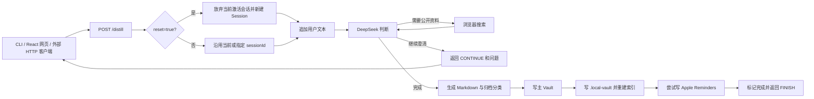

# ADHD Healing MVP PRD

## 1. 文档状态

- 版本：v0.2
- 状态：Implemented baseline
- 事实来源：当前 `main` 分支代码
- 产品形态：Mac 本地运行的单用户想法澄清与蒸馏网关

本文只描述当前代码已经提供并需要继续保持的 MVP 能力。更完整的语音知识库产品方向见 `docs/PRD.md`；历史方案不代表当前接口承诺。

## 2. 一句话定义

用户通过终端 CLI、React 网页或其他 HTTP 客户端提交文本，DeepSeek 通过多轮单点追问帮助用户澄清想法；完成后，系统生成 Markdown，写入本地主 Vault 和分类归档，并尝试把里程碑同步到 Apple Reminders。

## 3. 目标与成功标准

### 3.1 产品目标

1. 验证多轮主动澄清是否比一次性摘要更能形成可执行结果。
2. 让外部客户端保持简单，把会话状态与流程控制收敛到网关内部。
3. 把完成的结果沉淀为可被 Obsidian 等工具读取的本地 Markdown。
4. 把结果中的里程碑接入 Apple Reminders，形成行动出口。

### 3.2 成功标准

1. 文本请求可开始或继续一轮对话。
2. 每轮返回一个澄清问题或最终 Markdown。
3. 完成后同时产生主 Vault 文件和 `.local-vault` 分类归档，并重建归档索引。
4. 存在里程碑时尝试创建提醒；提醒失败不影响主响应。
5. React 网页与终端 CLI 均可继续历史会话，并展示当前执行状态。

## 4. 当前范围

### 4.1 已实现

| 模块 | 当前能力 |
| --- | --- |
| 输入入口 | 内置终端 CLI、React 网页，以及任何可调用 HTTP API 的外部客户端 |
| API | `POST /distill` 接收 JSON 请求并流式返回 NDJSON；另提供 `GET /sessions` 与 `POST /sessions/:id/activate` |
| 会话 | Prisma + SQLite 持久化会话历史，可按 `sessionId` 继续和切换 |
| 模型 | DeepSeek `deepseek-chat`，通过 Vercel AI SDK 调用 |
| 澄清 | LLM 在继续追问与最终输出之间做结构化决策 |
| 外部信息 | LLM 可按需调用 Google、DuckDuckGo 或 Bing 浏览器搜索 |
| 主 Vault | 最终 Markdown、YAML Front Matter 和用户原始输入写入 `BRAIN_VAULT_PATH` |
| 本地归档 | 写入 `.local-vault/<一级分类>/<二级分类>/` 并重建 `index.md` |
| 行动同步 | 通过 `osascript` 写入 Apple Reminders；失败降级为日志 |
| 调试网页 | 文本提交、执行进度、历史会话、新会话、恢复暂停任务和最终 Markdown 展示 |

### 4.2 当前不包含

1. 浏览器录音、音频上传和服务端语音转写。
2. PostgreSQL、pgvector、embedding 或跨会话语义检索。
3. 多人账户、跨设备权限控制或云端会话同步。
4. 原始音频归档、管理后台和知识聚类。
5. 本地 LM Studio 模型。

## 5. 端到端流程



## 6. 功能需求

### 6.1 配置与启动

| 编号 | 需求 |
| --- | --- |
| MVP-FR-001 | 服务使用 Bun + TypeScript 运行，默认监听 `5001` |
| MVP-FR-002 | 必须配置非空 `DEEPSEEK_API_KEY` |
| MVP-FR-003 | 必须配置绝对路径 `BRAIN_VAULT_PATH` |
| MVP-FR-004 | `PORT` 可选，必须是合法正整数端口 |
| MVP-FR-005 | 配置不合法时，启动必须失败并输出 Zod 校验信息 |
| MVP-FR-006 | 启动命令必须先构建 React 静态资源，再启动服务 |

### 6.2 API 与会话

| 编号 | 需求 |
| --- | --- |
| MVP-FR-101 | 提供 `POST /distill`，接收 JSON 请求并以 NDJSON 流返回结果 |
| MVP-FR-102 | `text` 必须为去除首尾空白后的非空字符串 |
| MVP-FR-103 | `reset`、`resume`、`sessionId` 和 `attachments` 为可选字段 |
| MVP-FR-104 | `reset=true` 时放弃当前激活会话并开启新会话 |
| MVP-FR-105 | 成功流的最终 `result` 事件必须包含 `{ status, sessionId, text }` |
| MVP-FR-106 | `status` 只能为 `CONTINUE`、`PAUSED` 或 `FINISH` |
| MVP-FR-107 | 请求校验失败返回 `400` 和 `{ error }` |
| MVP-FR-108 | 流启动前未处理异常返回 `500` 和 `{ error }`；流中异常返回 `type: "error"` 事件 |
| MVP-FR-109 | 系统必须为每轮会话分配并持久化 `sessionId` |
| MVP-FR-110 | 提供 `GET /sessions` 与 `POST /sessions/:id/activate` 供客户端恢复历史会话 |

### 6.3 澄清与搜索

| 编号 | 需求 |
| --- | --- |
| MVP-FR-201 | 使用 DeepSeek `deepseek-chat` 生成澄清决策 |
| MVP-FR-202 | 信息不足时返回一个聚焦问题 |
| MVP-FR-203 | 信息充分时返回最终 Markdown、标题、里程碑和归档分类 |
| MVP-FR-204 | 模型可按需调用浏览器搜索工具获取最新公开信息 |
| MVP-FR-205 | 搜索工具最多执行有限步骤，避免无限工具循环 |
| MVP-FR-206 | 最终归档分类必须包含一级分类、二级分类、摘要和标签 |

### 6.4 文件持久化与归档

| 编号 | 需求 |
| --- | --- |
| MVP-FR-301 | 主 Vault 目录不存在时自动创建 |
| MVP-FR-302 | 主 Vault 文件名由时间戳和安全标题组成 |
| MVP-FR-303 | 主 Vault 文件包含 YAML Front Matter、最终 Markdown 和用户原始输入 |
| MVP-FR-304 | 每个完成会话额外写入仓库根目录 `.local-vault` |
| MVP-FR-305 | 归档路径按模型生成的一级、二级分类组织 |
| MVP-FR-306 | 每次归档后重建 `.local-vault/index.md` |
| MVP-FR-307 | 归档内容保留最终 Markdown、原始输入和完整对话记录 |

### 6.5 Reminders 与网页

| 编号 | 需求 |
| --- | --- |
| MVP-FR-401 | 仅在里程碑非空时尝试同步 Apple Reminders |
| MVP-FR-402 | Reminders 同步失败只记录日志，不使最终请求失败 |
| MVP-FR-403 | `/` 提供构建后的 React 调试网页 |
| MVP-FR-404 | 网页支持文本提交、加载态、错误态、对话时间线和最终结果 |
| MVP-FR-405 | 网页“新会话”使下一次提交携带 `reset=true` |

## 7. API 契约

### 7.1 请求

```json
{
  "text": "我想做一个帮助记录灵感的工具",
  "reset": true,
  "resume": false,
  "sessionId": "optional-session-id"
}
```

### 7.2 事件流

```json
{ "type": "progress", "phase": "process", "message": "正在收敛问题范围" }
```

### 7.3 继续追问结果

```json
{
  "type": "result",
  "result": {
    "status": "CONTINUE",
    "sessionId": "session-1",
    "text": "你最希望它先解决记录、整理还是执行的问题？"
  }
}
```

### 7.4 暂停结果

```json
{
  "type": "result",
  "result": {
    "status": "PAUSED",
    "sessionId": "session-1",
    "text": "fetch failed"
  }
}
```

### 7.5 完成结果

```json
{
  "type": "result",
  "result": {
    "status": "FINISH",
    "sessionId": "session-1",
    "text": "## 今日灵感内核\n...",
    "tokenUsage": {
      "inputTokens": 1200,
      "outputTokens": 300,
      "totalTokens": 1500
    }
  }
}
```

## 8. 约束与风险

1. 当前仍是本地单用户模型，没有账户系统、鉴权和多租户隔离。
2. 浏览器刷新会丢失当前页面状态，但历史会话仍需通过 `/sessions` 手动重新激活。
3. 主 Vault 或归档写入失败会使完成请求返回 `500`。
4. DeepSeek 与浏览器搜索依赖网络；搜索站点结构变化可能导致结果质量下降。
5. Reminders 仅支持 macOS，且首次使用需要系统授权。

## 9. 验收

```bash
pnpm test
pnpm lint
pnpm exec tsc --noEmit
pnpm run build:web
```

手工验收还应覆盖：首次请求、连续追问、主动重置、完成后两个 Vault 产物、归档索引和 Reminders 降级行为。

## 10. 后续候选

以下能力需要单独立项，不属于当前 MVP 契约：

1. 音频输入与本地或云端 ASR。
2. 多用户协作与远程访问控制。
3. PostgreSQL/pgvector 历史语义检索。
4. 本地模型和离线模式。
5. 归档搜索 UI 与自动主题合并。