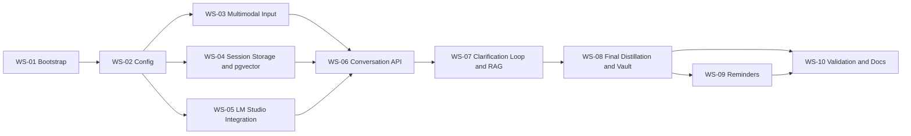

# Record Tips MVP Development Tasks

## 1. Document Goal

This document decomposes `docs/PRD-MVP.md` into implementation tasks.
All tasks here are in MVP scope and map back to requirement IDs.

## 2. Delivery Principles

1. Build the narrowest useful loop first: web audio or text input -> `/distill` -> LLM clarifying question -> user reply -> final Markdown.
2. Preserve the React web client as the only interaction shell; all multi-turn behavior must work through `session_id` and structured server responses.
3. Add persistence before polish: session history, pgvector retrieval, and local Markdown vault are mandatory in MVP.
4. Keep the system single-user and local-first; do not expand into native iOS app work or multi-user workflows.
5. Every task must have an executable acceptance check.

## 3. Workstreams

| Workstream | Goal |
| --- | --- |
| WS-01 | Environment and project bootstrap |
| WS-02 | Config and process startup |
| WS-03 | Multimodal input and transcription |
| WS-04 | Session storage and PostgreSQL pgvector initialization |
| WS-05 | LM Studio integration |
| WS-06 | Conversation API and web client contract |
| WS-07 | Clarification loop and RAG assembly |
| WS-08 | Final distillation and local vault persistence |
| WS-09 | Apple Reminders integration |
| WS-10 | End-to-end validation and operational docs |

## 4. Dependency Sequence

## 5. Task List

| ID | Workstream | Task | Deliverable | Requirement Mapping | Depends On | Acceptance Criteria |
| --- | --- | --- | --- | --- | --- | --- |
| T-001 | WS-01 | Initialize Bun + TypeScript service entry | `server.ts` runnable by Bun | MVP-FR-101, MVP-FR-102, MVP-FR-701 | None | Running `bun --env-file=.env server.ts` starts a listening process |
| T-002 | WS-01 | Install runtime and typing dependencies | `package.json` contains `pg`, `@types/pg`, AI SDK, and required HTTP/audio helpers | MVP-FR-005 | None | Dependency install completes and lockfile is generated |
| T-003 | WS-02 | Add `.env` loading contract | `.env.example` or documented required variables | MVP-FR-002, MVP-FR-003 | T-001 | Required variables are visible in startup documentation |
| T-004 | WS-02 | Implement startup validation for `BRAIN_VAULT_PATH` and `DATABASE_URL` | Process exits fast on missing config | MVP-FR-004 | T-003 | Missing variable causes non-zero exit and readable error log |
| T-005 | WS-03 | Define web input contract | Request spec for `audio|text`, optional `session_id`, and response handling | MVP-FR-103, MVP-FR-104, MVP-FR-107, MVP-FR-703, MVP-FR-704 | T-003 | The web client can follow one documented request/response contract for every turn |
| T-006 | WS-03 | Implement text input normalization | Shared text cleaning path for manual input | MVP-FR-105 | T-005 | Text input is accepted, trimmed, and forwarded consistently |
| T-007 | WS-03 | Implement audio upload parsing | Audio request handling for browser uploads | MVP-FR-106 | T-005 | Audio file can be received and validated by the service |
| T-008 | WS-03 | Implement transcription adapter | `transcribeAudio(audio)` path for voice input | MVP-FR-201, MVP-FR-202, MVP-FR-702 | T-007 | Valid audio returns transcription text or a clear error |
| T-009 | WS-04 | Create PostgreSQL client module | Shared connection setup | MVP-FR-301, MVP-FR-302, MVP-FR-303, MVP-FR-304 | T-004 | Service can connect to configured `DATABASE_URL` |
| T-010 | WS-04 | Auto-enable pgvector extension | `CREATE EXTENSION IF NOT EXISTS vector;` on boot | MVP-FR-301 | T-009 | Fresh database gains `vector` extension after startup |
| T-011 | WS-04 | Auto-create `idea_sessions` table | Session table creation SQL | MVP-FR-302, MVP-FR-305 | T-010 | Fresh database contains `idea_sessions` with required columns |
| T-012 | WS-04 | Auto-create `session_messages` table | Message table creation SQL | MVP-FR-303, MVP-FR-306, MVP-FR-309 | T-011 | Fresh database contains `session_messages` with required columns |
| T-013 | WS-04 | Auto-create `my_ideas` table | Final idea table with `vector(768)` | MVP-FR-304, MVP-FR-307, MVP-FR-308 | T-010 | Fresh database contains `my_ideas` with `vector(768)` |
| T-014 | WS-04 | Implement vector serialization helper | `formatVectorForPg(vector)` | MVP-FR-311 | T-013 | A 768-dim array is converted into valid pgvector text format |
| T-015 | WS-05 | Configure LM Studio OpenAI-compatible client | Model gateway setup | MVP-FR-203 | T-004 | Service can target `http://localhost:1234/v1` |
| T-016 | WS-05 | Implement embedding generation | `getEmbedding(text)` returns 768 dims from the configured model | MVP-FR-204, MVP-FR-206 | T-015 | Embedding request succeeds only when the configured model is available |
| T-017 | WS-05 | Implement clarification and final-distill prompts | Prompt templates for ask/finalize decisions | MVP-FR-205, MVP-FR-207, MVP-FR-208, MVP-FR-209, MVP-FR-406 | T-015 | LLM can produce either one focused question or final Markdown |
| T-018 | WS-06 | Create unified `POST /distill` handler | HTTP endpoint skeleton | MVP-FR-103, MVP-FR-108, MVP-FR-109 | T-001 | Endpoint accepts requests and returns structured JSON |
| T-019 | WS-06 | Add multimodal request validation and error responses | `400` for invalid mode/content; `500` for execution failures | MVP-FR-105, MVP-FR-106, MVP-FR-110, MVP-FR-111 | T-018 | Bad text or missing audio fails with `400`; thrown errors fail with `500` |
| T-020 | WS-06 | Implement session create/load behavior | `loadOrCreateSession(sessionId)` and turn counting | MVP-FR-107, MVP-FR-305, MVP-FR-309 | T-011, T-012, T-018 | First request creates session; later requests resume same session |
| T-021 | WS-06 | Persist each user turn into `session_messages` | Session-aware turn logging | MVP-FR-309 | T-020, T-006, T-008 | Every user turn is stored with `role=user` and `input_mode` |
| T-022 | WS-07 | Build aggregated session context | Concatenate prior user answers and assistant prompts | MVP-FR-401, MVP-FR-403 | T-020, T-021 | Current turn sees prior same-session history |
| T-023 | WS-07 | Implement historical similarity query | SQL retrieval ordered by vector distance | MVP-FR-311, MVP-FR-312, MVP-FR-401, MVP-FR-402 | T-014, T-016, T-022 | Sessions retrieve top-2 similar completed ideas or default to no-history text |
| T-024 | WS-07 | Implement clarify-or-final decision logic | One-turn assistant controller | MVP-FR-207, MVP-FR-208, MVP-FR-209, MVP-FR-403 | T-017, T-022, T-023 | Service decides whether to ask one question or emit final Markdown |
| T-025 | WS-07 | Persist assistant clarification turns | `role=assistant` messages for question turns | MVP-FR-309 | T-024 | Every clarification question is stored in the session log |
| T-026 | WS-08 | Implement final Markdown generation and parsing | `extractSection(mdText, header)` for title and milestone | MVP-FR-404, MVP-FR-405, MVP-FR-406 | T-024 | Final output includes required sections and parseable title/milestone |
| T-027 | WS-08 | Persist completed ideas into `my_ideas` | Insert SQL for vector and final texts | MVP-FR-310, MVP-FR-706 | T-023, T-026 | Completed session creates one new final idea row |
| T-028 | WS-08 | Implement local vault directory bootstrap and filename policy | Safe directory creation and naming | MVP-FR-501, MVP-FR-502, MVP-FR-503 | T-004, T-026 | Missing directory is created and file name is valid on macOS |
| T-029 | WS-08 | Implement final Markdown file template | YAML front matter + final markdown + aggregated raw text block | MVP-FR-504, MVP-FR-505, MVP-FR-506, MVP-FR-705 | T-028, T-026 | Created file contains front matter, final result, and raw input rollup |
| T-030 | WS-09 | Implement Reminders JXA integration | `syncToAppleReminders(taskTitle)` | MVP-FR-601, MVP-FR-602, MVP-FR-603, MVP-FR-604, MVP-FR-707 | T-026 | Valid milestone triggers reminder creation; failure only logs |
| T-031 | WS-09 | Guard reminder sync with milestone presence | No-op when milestone is missing | MVP-FR-601, MVP-FR-602 | T-030 | Empty milestone does not break request flow |
| T-032 | WS-10 | Add startup and processing logs | Logs for transcription, sessions, retrieval, persistence, reminders | Supports MVP-FR-702, MVP-FR-705, MVP-FR-706, MVP-FR-707 | T-021, T-027, T-029, T-030 | Logs identify where a failed turn stopped |
| T-033 | WS-10 | Document web conversation loop behavior | Runbook for session_id retention and follow-up turns | MVP-FR-703, MVP-FR-704 | T-005, T-018 | Another developer can rebuild the web flow from docs |
| T-034 | WS-10 | Document local environment setup | Setup guide for Docker, ASR, LM Studio, `.env`, Bun command | MVP-FR-001, MVP-FR-701, MVP-FR-702 | T-001 to T-033 | New developer can start the stack from docs alone |
| T-035 | WS-10 | Validate full end-to-end text-mode flow | Manual test cases and evidence capture for manual text sessions | MVP-FR-704, MVP-FR-705, MVP-FR-706, MVP-FR-707 | T-027, T-029, T-030, T-033, T-034 | Text mode supports at least one clarifying turn and one final result |
| T-036 | WS-10 | Validate full end-to-end audio-mode flow | Manual test cases and evidence capture for audio sessions | MVP-FR-201, MVP-FR-202, MVP-FR-704, MVP-FR-705, MVP-FR-706, MVP-FR-707 | T-008, T-027, T-029, T-030, T-033, T-034 | Audio mode supports transcription, clarifying turns, final persistence, and reminders path |
| T-037 | WS-10 | Validate cross-session RAG reuse | Repeat-session evidence for historical retrieval | MVP-FR-401, MVP-FR-402 | T-035, T-036 | A later completed session references a prior similar idea |

## 6. Definition of Done

An MVP task is only done when all conditions below are met:

1. Implementation is merged into the main workspace branch.
2. The mapped MVP requirement can be demonstrated locally.
3. Failure behavior is explicit for the task boundary.
4. A manual or executable validation step has been recorded.

## 7. Recommended Execution Order

1. T-001 to T-004
2. T-005 to T-008
3. T-009 to T-014
4. T-015 to T-021
5. T-022 to T-027
6. T-028 to T-031
7. T-032 to T-037

## 8. Test Checklist

| Scenario | Expected Result |
| --- | --- |
| Start service without `.env` | Process exits with configuration error |
| Start service with DB down | Startup or first DB call reports connection failure clearly |
| Submit invalid text-mode request | API returns `400` |
| Submit invalid audio-mode request | API returns `400` |
| Submit first valid text request | API returns JSON with `response_type=clarify` or `final` and a `session_id` |
| Continue a text session with same `session_id` | Service preserves context and advances turn count |
| Submit first valid audio request | Audio is transcribed and enters the same question/final flow |
| Reach final state | DB final row inserted, vault file created, final JSON returned |
| Start a later similar session | Query retrieves historical context and response references prior idea |
| LM Studio embedding unavailable | Startup or request fails with a clear model configuration error |
| Reminders permission denied | Final request still succeeds, reminder failure is logged |

## 9. Open Implementation Decisions

| Topic | Current Decision | Why |
| --- | --- | --- |
| Interaction shell | Keep the React web client for first turn and follow-up turns | Preserves one consistent entry point |
| Input transport | Use one endpoint with `audio|text` modes and optional `session_id` | Keeps the web flow simple |
| Response contract | Return JSON envelope, not plain Markdown | The web client must know whether to continue asking or stop |
| Session persistence | Store session history in PostgreSQL | Needed for multi-turn clarification continuity |
| Retrieval size | Top 2 similar completed ideas | Enough context without prompt bloat |
| Clarification limit | Max 3 assistant questions before forced finalization or user override | Prevents endless loops |
| Vault file format | Markdown with YAML front matter | Compatible with Obsidian and local-first PKM tools |
| Reminder target list | Default `Reminders` list | No extra configuration needed in MVP |
